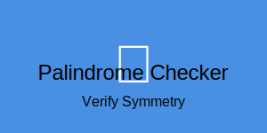

# Palindrome Checker Program 🔄
---
[In Python GUI](https://github.com/mdriyadkhan585/palindrome-checker-gui)

[In C Script](https://github.com/mdriyadkhan585/palindrome-checker-c)



---
Welcome to the Palindrome Checker program! This Python application determines if a given string reads the same backward as forward. It handles multi-line inputs, ignores non-alphanumeric characters, and is case-insensitive. Follow the instructions below to understand and use the program.

## Features ✨

- **Palindrome Detection**: Checks if the input string is a palindrome.
- **Multi-Line Input Support**: Allows long inputs across multiple lines.
- **Formatted Output**: Provides clear and user-friendly messages with emojis.
- **User Interaction**: Prompts for continuous checks or exit.

## How to Use 📜

### Installation ⚙️

1. Ensure you have Python installed on your system (Python 3.6 or later recommended).
2. Save the Python code into a file named `palindrome_checker.py`.

### Running the Program 🚀

1. Open a terminal or command prompt.
2. Navigate to the directory where `palindrome_checker.py` is saved.
3. Run the program using Python.

   ```bash
   git clone https://github.com/mdriyadkhan585/palindrome-checker-python
   cd palindrome-checker-python
   python palindrome_checker.py
   ```

### Using the Program 🖥️

1. **Enter a String**: When prompted, enter the string you want to check.
   - For multi-line input, end each line with a backslash (`\`) to continue on the next line.
2. **View Results**: The program will indicate whether the input string is a palindrome.
3. **Continue or Exit**: After checking, you’ll be asked if you want to check another string.
   - Type `y` or `Y` to check another string.
   - Type `n` or `N` to exit the program.

### Example Usage 🏆

```plaintext
Palindrome Checker Program
==============================

Enter a string: A man a plan a canal Panama
✅ The input string is a palindrome.

Do you want to check another string? (y/n): y

Enter a string: Hello, World!
❌ The input string is not a palindrome.

Do you want to check another string? (y/n): n

Thank you for using the Palindrome Checker!
==============================================
```

## Code Overview 📝

### `is_palindrome` Function 🔍

- **Purpose**: Checks if a string reads the same forward and backward.
- **How It Works**: 
  - Removes non-alphanumeric characters.
  - Converts the string to lowercase and compares it with its reverse.

### `format_text` Function ✨

- **Purpose**: Formats text for improved readability.
- **How It Works**: Adds decorative lines for titles and returns plain text for other messages.

### `main` Function 🏠

- **Purpose**: Manages user interaction and input processing.
- **Features**:
  - Handles multi-line input.
  - Checks if the input string is empty and provides feedback.
  - Asks if the user wants to continue or exit.

## Troubleshooting 🛠️

- **Input Issues**: Ensure that input is provided correctly and multi-line input ends with a backslash.
- **Python Errors**: Verify you are using Python 3.6 or later and the code is saved properly.

## Contributing 🤝

Contributions are welcome! If you have suggestions or improvements, please submit pull requests or report issues via [GitHub](https://github.com/mdriyadkhan585).

## License 📜

This project is licensed under the MIT License - see the [LICENSE](LICENSE) file for details.

---
